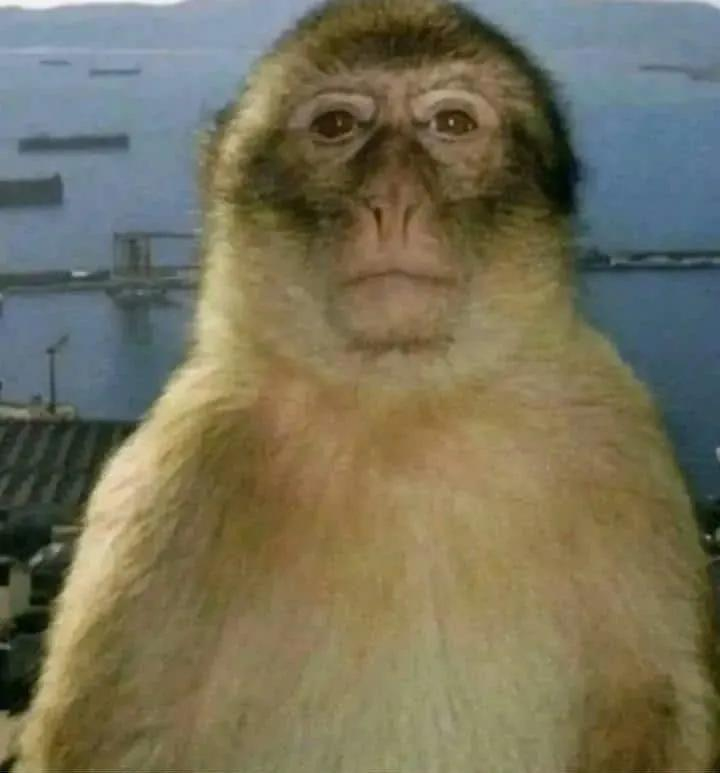
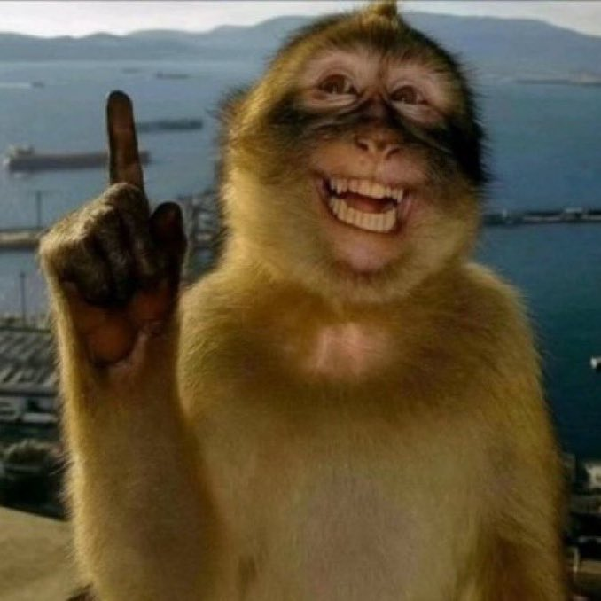

# Mreme / Meme Mirror

A real-time pose detection application built with Python, OpenCV, and MediaPipe that displays specific monkey memes based on your body poses. The app uses computer vision to instantly detect and match four distinct states: Staring (neutral), Thinking (hand on mouth), Pointing (finger up), and Shocked (open mouth), displaying the corresponding monkey meme template in real-time.

<p align="center">
  
  
  
  
</p>

## Features

- Real-time pose detection using MediaPipe Holistic
- Automatic monkey meme matching based on detected poses
- Multiple display modes (split view, side-by-side, picture-in-picture)
- Screenshot and video recording capabilities
- Face overlay onto monkey meme templates
- Vertical mode for social media export

## Supported Poses

| Pose | How to Trigger |
|------|----------------|
| Staring | Default state - just look at the camera |
| Thinking | Touch your finger to your chin |
| Pointing | Point your finger above your head |
| Shocked | Open your mouth wide |

## Requirements

- Python 3.11+
- Computer with a webcam
- Libraries in requirements.txt

## Setup and running program

```bash
pip install -r requirements.txt
```

```bash
python main.py
```

## Controls

| Key | Function |
|-----|----------|
| Q | Quit |
| H | Show/hide help overlay |
| S | Take screenshot |
| R | Start/stop video recording |
| G | Export GIF frames |
| F | Toggle fullscreen |
| P | Pause |
| M | Meme-only view |
| B | Side-by-side view |
| I | Picture-in-picture mode |
| V | Vertical mode (9:16 aspect ratio) |
| W | Toggle watermark |
| A | Toggle face overlay on meme |
| Z | Toggle face zoom |
| N | Toggle smooth transitions |
| C | Switch camera |
| ←/→ | Manually cycle through memes |
| ↑ | Return to auto-detection |